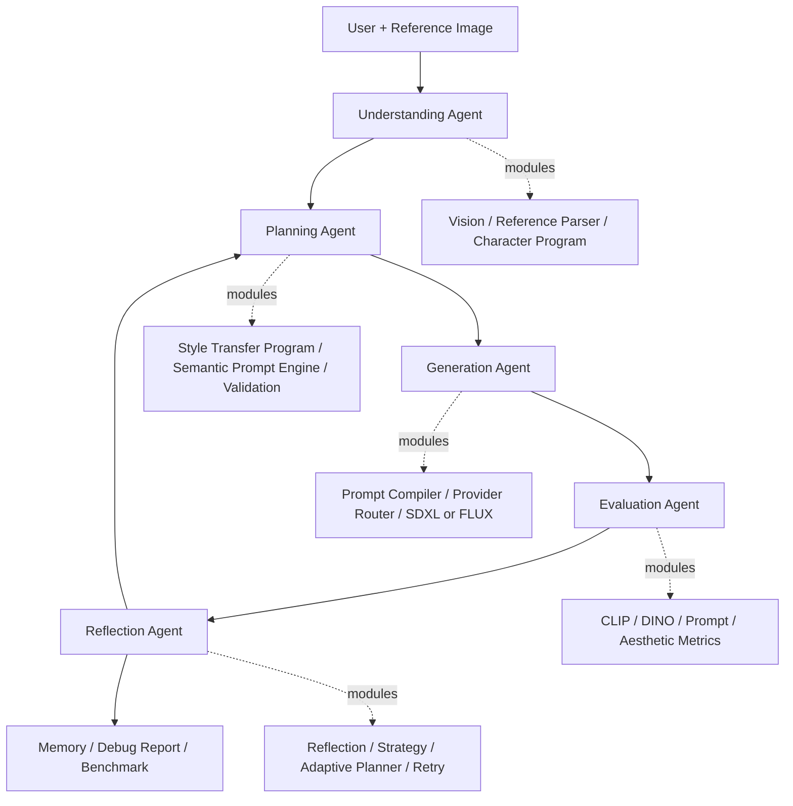

# Architecture

This document describes the v3 5-Agent Architecture of Multimodal AI Agent Playground.

The project is a reference-aware multimodal AI Agent framework for style transfer. Existing small agents are treated as internal modules inside five top-level agents.

## Target Architecture v3

```text
User
  |
  v
Understanding Agent
  |
  v
Planning Agent
  |
  v
Generation Agent
  |
  v
Evaluation Agent
  |
  v
Reflection Agent
```

## Agent Responsibilities

| Agent | Responsibility | Internal Examples |
| --- | --- | --- |
| Understanding Agent | Understand the reference image and extract structured visual context. | VisionAgent, VLMRouter, BLIP, Florence-2, ReferenceImageParser, CharacterProgramBuilder |
| Planning Agent | Convert user intent into Style Transfer Program, Semantic Prompt Program, constraints, and validation results. | LLMStyleTransferPlanner, GoalPlanner, ScenePlanningAgent, SemanticPromptEngine, ConflictResolver, PromptSanitizer, PromptValidator |
| Generation Agent | Render provider-specific prompts and run reference-aware generation. | PromptCompiler, ProviderRouter, ProviderPromptAdapter, GenerationRouter, FLUX, SDXL Img2Img, IP-Adapter hook, ControlNet hook |
| Evaluation Agent | Evaluate output with multiple metrics. | EvaluationAggregator, CLIPMetric, DINOIdentityMetric, PromptMetric, AestheticMetric |
| Reflection Agent | Analyze results, select strategy, adapt plan, retry, and record observability data. | ReflectionAgent, SelfVerification, StrategySelector, AdaptivePlanner, RetryAgent, MemorySave, DebugReport |

## Mermaid Diagram



## Runtime Flow

1. Understanding Agent reads the image reference and produces structured visual context.
2. Planning Agent turns user intent and reference context into Style Transfer Program and Semantic Prompt Program.
3. Generation Agent renders provider prompts and generates with FLUX or SDXL Img2Img plus optional conditioning hooks.
4. Evaluation Agent scores the output with metric-specific prompts and image similarity metrics.
5. Reflection Agent analyzes failure modes, updates planning strategy, decides retry, and records memory/debug output.

## LLM Requirement Parser v4.0

The Planning Agent owns the Requirement Parser. Its job is to convert long user requirements into Style Transfer Program JSON. It is not a prompt writer.

```text
User Requirement
  |
  v
LLM Requirement Parser
  |
  v
Structured Style Transfer Program JSON
  |
  v
Semantic Prompt Compiler
  |
  v
Provider Prompt Compiler
  |
  v
Generation
```

`LLM_PROVIDER=rule` uses deterministic parsing. `LLM_PROVIDER=openai` attempts OpenAI JSON parsing with `OPENAI_MODEL` defaulting to `gpt-5-mini`; missing API keys, client errors, or invalid JSON all fall back to rule parsing. Semantic Prompt Compiler and Provider Prompt Compiler continue to own final prompt rendering.

## Physical Module Layout v3.3

The codebase mirrors the 5-Agent explanation with compressed `agents/`, `modules/`, and `core/` packages:

| Area | Folder |
| --- | --- |
| Top-level agent entry points | `agents/` |
| Understanding implementations | `modules/understanding/` |
| Planning implementations | `modules/planning/` |
| Prompt planning/rendering helpers | `modules/prompt/` |
| Generation implementations | `modules/generation/` |
| Evaluation implementations | `modules/evaluation/` |
| Reflection implementations | `modules/reflection/` |
| Knowledge helper modules | `modules/memory/` |
| Cross-cutting core APIs | `core/` |

Small `agents/*` wrappers were removed in v3.3. Runtime entry points continue to use `agents.orchestrator_agent.OrchestratorAgent`, while implementation dependencies are imported from `modules.*` and compressed core façades such as `core.semantic_prompt_engine`.

## Runtime Coordination

`OrchestratorAgent` is not part of the five-agent responsibility model. It is the runtime coordinator that asks `PlanningAgent` for the execution plan, creates the initial state, and delegates execution to `DynamicExecutionEngine`.

Tool construction and module registration are isolated in `registry/tool_registry_factory.py`:

```text
OrchestratorAgent
  |
  +-- core/state_keys.py
  +-- core/result_builder.py
  +-- build_tool_registry()
  |     +-- register_understanding_tools
  |     +-- register_planning_tools
  |     +-- register_generation_tools
  |     +-- register_evaluation_tools
  |     +-- register_reflection_tools
  |     +-- register_infrastructure_tools
  |
  +-- DynamicExecutionEngine
```

The factory preserves existing tool names and adds agent-group metadata where tools are registered. This keeps the code aligned with the five-agent architecture without changing provider, generation, or evaluation behavior.

`core/result_builder.py` owns the public result dictionary returned by the pipeline. This preserves existing output keys while keeping Orchestrator focused on workflow coordination.

## Vision Layer v1.5

The Vision Layer no longer treats BLIP as the framework boundary. `VisionAgent` calls `VLMRouter`, and the selected provider returns a shared `vision_result`.

```text
Image
  |
  v
VisionAgent
  |
  v
VLMRouter
  |
  +-- BLIPVLM (default)
  +-- FlorenceVLM (Florence-2 adapter, BLIP fallback)
  |
  v
Standard Vision Result
  |
  v
ReferenceImageParser
```

Florence-2 is routed through task prompts sequentially:

```text
FlorenceVLM
  |
  +-- <CAPTION>          -> caption
  +-- <DETAILED_CAPTION> -> detailed_caption
  +-- <OD>               -> objects[{name, bbox}]
  +-- OCR skeleton       -> ocr[]
```

### Standard Vision Result Schema

Every provider returns these core fields:

```json
{
  "caption": "",
  "detailed_caption": "",
  "objects": [],
  "regions": [],
  "characters": [],
  "scene": {},
  "style": {},
  "ocr": [],
  "colors": {},
  "composition": {},
  "provider": "",
  "model": "",
  "used_fallback": false,
  "latency": 0.0
}
```

Backward-compatible aliases such as `detailed_description`, `character_hints`, and `composition_hints` are still preserved for older downstream components.

### Reference Parsing Priority

`ReferenceImageParser` now reads structured fields first:

```text
objects
-> detailed_caption
-> caption
-> fallback parsing
```

This keeps caption parsing as a fallback while allowing Florence-2 object detection and detailed captions to supply richer visual understanding when available. Object records are normalized as `{name, bbox}` so accessories and props can be preserved as structured reference context.

## Reasoning Boundary

For this v1.1 VLM-only stabilization, LLM reasoning remains on the existing rule/mock fallback path. OpenAI API calls are not required for the default workflow.

## Prompt Rendering Engine v1.2

The Context Layer renders different prompts for different model-facing jobs:

```text
Context Program
  |
  v
Prompt Rendering Engine
  |
  +-- generation_prompt
  +-- clip_prompt
  +-- pickscore_prompt
  +-- vlm_judge_prompt
  +-- negative_prompt
```

`generation_prompt` preserves the existing provider generation behavior. `clip_prompt` is a short semantic summary that removes quality-only terms and negative prompt language. `pickscore_prompt` keeps preference-oriented quality, composition, and style cues. `vlm_judge_prompt` is a longer instruction for future visual judging against reference and generated images.

## Long Prompt Structuring v2.5

Long user prompts are structured before they become model-facing prompts:

```text
User Prompt
  |
  v
Style Transfer Program
  |
  v
Prompt Sanitizer
  |
  v
Prompt Validator
  |
  +-- FLUX dense prompt
  +-- SDXL Img2Img style prompt
  +-- CLIP semantic prompt
  +-- negative prompt
```

The `style_transfer_program` stores style, layout, pose/expression rules, text rules, negative prompt terms, and `forbidden_concepts`. Korean photobooth prompts are normalized into a vertical four-frame photobooth layout, and ugly-cute / MS Paint prompts are normalized into a rough hand-drawn style program.

User forbidden intent has the highest priority. If the user asks to remove weapons, weapon-related concepts are removed from final generation-facing prompts even when the reference caption contains a sword. The validator records `prompt_validation_report` with forbidden concept survival, duplicate count, SDXL token count, CLIP token count, and required style/layout preservation.

## Style Transfer Preset Manager v2.6

The Generation Layer reads the `style_transfer_program` and selects a generation preset before SDXL Img2Img runs:

```text
style_transfer_program
  |
  v
StylePresetManager
  |
  v
generation_preset
  |
  +-- sdxl_strength
  +-- ip_adapter_scale
  +-- cfg
  +-- steps
  +-- resolution
```

Supported presets include `subtle_transfer`, `balanced_transfer`, `strong_style_transfer`, `photobooth_soft`, `ugly_cute_drawing`, `anime_webtoon`, and `realistic_preserve`.

The preset is still manually overridable through environment variables: `SDXL_STRENGTH`, `IP_ADAPTER_SCALE`, `SDXL_CFG`, `SDXL_STEPS`, `SDXL_WIDTH`, and `SDXL_HEIGHT`. Debug reports store `generation_preset`, `preset_reason`, and `environment_overrides`.

## Reference Conditioning Pipeline v2.8

Before SDXL Img2Img or IP-Adapter receives the reference image, the Generation Layer analyzes and preprocesses it:

```text
Reference Image
  |
  v
Reference Analyzer
  |
  v
Reference Preprocessor
  |
  v
Conditioning Package
  |
  +-- SDXL Img2Img image
  +-- IP-Adapter image
```

The analyzer records image width, height, aspect ratio, estimated character ratio, background ratio, face ratio, focus, and quality. The preprocessor supports aspect-ratio-preserving resize, automatic center crop, automatic padding, and longest-edge resize. Debug reports store `reference_analysis`, `conditioning_summary`, and `conditioned_reference_path`.

## ControlNet Hook v2.9

The Generation Layer includes an optional ControlNet hook for SDXL Img2Img:

```text
Conditioned Reference
  |
  v
Canny Control Image
  |
  v
SDXL Img2Img + optional IP-Adapter + optional ControlNet
```

IP-Adapter is used for identity/reference feature preservation. ControlNet is used for pose, silhouette, composition, and structural preservation. v2.9 implements Canny control image generation first. Depth and OpenPose remain skeleton hooks. If ControlNet cannot be loaded, the provider records fallback status and continues through the existing SDXL Img2Img + IP-Adapter path.

## Semantic Prompt Engine v2.7

The Context Layer no longer treats the prompt as only a growing string. It first creates a semantic program:

```text
Prompt Blocks + Style Transfer Program
  |
  v
Semantic Prompt Program
  |
  +-- identity
  +-- style
  +-- layout
  +-- scene
  +-- lighting
  +-- quality
  +-- negative
  +-- constraints
```

The engine then runs:

```text
Semantic Merge
  |
  v
Conflict Resolver
  |
  v
Provider Renderer
  |
  +-- FLUX dense prompt
  +-- SDXL style prompt
  +-- CLIP evaluation prompt
```

Semantic Merge reduces meaning-level duplicates such as `anime`, `anime style`, and `anime illustration`. Conflict Resolver gives user intent priority, so a request like `remove weapon` sets `weapon=false` and prevents weapon-related text from being rendered into generation-facing prompts. Provider Renderer keeps provider-specific prompt behavior while sharing the same semantic source of truth.

## LLM Style Transfer Planner v3.0

The LLM is used as an AI Agent planner, not as a final prompt writer:

```text
User Request
  |
  v
LLM Style Transfer Planner
  |
  v
Style Transfer Program JSON
  |
  v
Semantic Prompt Engine
  |
  v
Provider-specific Rendering
```

The planner outputs structured fields such as `style_goal`, `identity_policy`, `style`, `layout`, `generation_strategy`, `forbidden_concepts`, and `negative_prompt`. If `LLM_PROVIDER=rule` or OpenAI is unavailable, the workflow uses the existing rule-based Style Transfer Program fallback. Final generation prompts are always rendered by the Semantic Prompt Engine.

## Evaluation Prompt Routing v1.3

The Evaluation Layer consumes prompt variants by metric:

```text
generation_prompt -> Generation Provider
clip_prompt       -> CLIP Metric
generation_prompt + context_program -> Prompt Metric
pickscore_prompt  -> Aesthetic / future PickScore-style metric
vlm_judge_prompt  -> VLM Judge skeleton
reference image + generated image -> DINO Identity Metric
```

CLIP does not receive the full generation prompt. This keeps evaluation under the short CLIP text budget and prevents quality-only tags or negative prompt terms from distorting semantic alignment.

## DINO Identity Metric v1.4

DINO complements CLIP instead of replacing it:

```text
CLIP: prompt text <-> generated image semantic alignment
DINO: reference image <-> generated image visual consistency
```

When a reference image and generated image are available, the DINO metric attempts to use `facebook/dinov2-small` through the existing `torch` and `transformers` stack. If the model cannot be loaded or either image is missing, the metric returns an enabled=false fallback result and the Evaluation Layer uses the existing rule-based identity score.

## Evaluation Layer Stabilization v1.6

v3.6 consolidates concrete metric implementations into `evaluation/metrics.py`; `evaluation/evaluation_aggregator.py` still owns metric execution, weighting, fallback normalization, and the stable result schema.

Every metric returns the same schema:

```json
{
  "name": "",
  "score": 0.0,
  "enabled": true,
  "reason": "",
  "used_fallback": false
}
```

The aggregator always exports:

```json
{
  "metrics": [],
  "semantic_alignment": 0.0,
  "identity_preservation": 0.0,
  "prompt_consistency": 0.0,
  "aesthetic_quality": 0.0,
  "overall_score": 0.0,
  "weighted_score": 0.0,
  "metric_summary": "",
  "used_fallback": false
}
```

Weighted score uses only enabled metrics. If all weighted metrics are disabled, `weighted_score` is `0.0` and `used_fallback` becomes `true`. This keeps Reflection, Retry, Debug Report, FastAPI, Gradio, and Benchmark consumers compatible with a stable score contract.

## Context Cache and Incremental Execution v1.7

The Execution Engine can skip selected layers when their input signature has not changed.

```text
Input
  |
  v
Planning Layer
  |
  v
Dirty Check
  |
  +-- cache hit  -> restore artifact and skip step
  +-- cache miss -> run step and update cache
  |
  v
Context / Generation / Evaluation
```

Cached artifacts:

- `goal_tree`
- `caption` and `vision_result`
- `reference_image`
- `character_program`
- `context_program`
- prompt compiler outputs such as `generation_prompt`, `clip_prompt`, and `compiled_prompt_package`
- `output_image_path` when the generation prompt is unchanged and the cached image file exists

Debug reports record:

- `executed_layers`
- `skipped_layers`
- `dirty_reasons`
- `context_cache_path`

This keeps repeated runs inspectable while avoiding unnecessary work for unchanged planning/context/generation inputs.

## Generation Quality Upgrade v2.0

The Generation Layer is provider-independent at the routing boundary:

```text
Reference Image
  |
  v
Vision Parser
  |
  v
Context Program
  |
  v
Prompt Rendering
  |
  v
Generation Planner
  |
  v
Generation Router
  |
  +-- fast    -> flux_fast    -> FLUX
  +-- quality -> sdxl_quality -> SDXL Img2Img
  |
  +-- future  -> IP Adapter / ControlNet hooks
```

Quality Mode applies a preset before generation:

```json
{
  "cfg": 7.5,
  "steps": 30,
  "resolution": "1024x1024",
  "scheduler": "DPM++ 2M Karras"
}
```

The current SDXL path uses Diffusers `StableDiffusionXLImg2ImgPipeline`. It loads the configured SDXL model, opens the reference image as a PIL image, resizes it to the generation resolution, and calls Img2Img with prompt, negative prompt, steps, CFG, and strength. If model loading or generation fails, it returns a clear fallback status and does not create a mock image. FLUX behavior remains intact.

## Reference Conditioning Interface v2.1

The Context Layer prepares a provider-facing reference conditioning package:

```json
{
  "enabled": false,
  "reference_image_path": "",
  "conditioning_type": "none",
  "identity_strength": 0.0,
  "style_strength": 0.0,
  "structure_strength": 0.0,
  "preserve": {
    "hair": true,
    "eye_color": true,
    "outfit": true,
    "accessories": true,
    "silhouette": true
  },
  "notes": []
}
```

When quality mode or reference preservation is requested, the package can be used by SDXL Img2Img through its `reference_image_path`. IP-Adapter and ControlNet fields remain future extension points.

Future integration point:

```text
Prompt Rendering
  +
Reference Conditioning Package
  |
  v
Generation Provider
  +-- IP Adapter
  +-- ControlNet
  +-- img2img
```

## SDXL Quality Provider v2.2

Generation Router supports two provider IDs:

```text
GENERATION_PROVIDER=flux_fast    -> Fast Mode    -> FLUX
GENERATION_PROVIDER=sdxl_quality -> Quality Mode -> SDXL Quality Provider
```

Quality Mode uses a `GenerationConfig` object:

```json
{
  "provider": "sdxl_quality",
  "mode": "quality",
  "width": 1024,
  "height": 1024,
  "steps": 30,
  "cfg": 7.5,
  "strength": 0.55,
  "scheduler": "DPM++ 2M Karras",
  "resolution": "1024x1024"
}
```

Providers return a `GenerationResult` with output path, backend, mode, config, latency, prompt length, notes, and fallback status. The SDXL provider uses `diffusers.StableDiffusionXLImg2ImgPipeline` with `SDXL_MODEL_ID`, reference image, `strength`, steps, CFG, and resolution. Reference Conditioning now has a real Img2Img path, while IP-Adapter and ControlNet remain future provider-layer hooks.

## SDXL Style Prompt Renderer v2.3

Generation Router now applies provider-specific prompt rendering:

```text
Context / Prompt Compiler
  |
  v
Generation Router
  |
  +-- flux_fast    -> Dense Prompt
  |
  +-- sdxl_quality -> Style Prompt
```

FLUX keeps the dense visual prompt because it depends on prompt text for subject, identity, composition, style, and quality. SDXL Img2Img receives a short style-only prompt because the reference image already provides identity.

The SDXL style prompt is built only from `style_program`:

- style
- lighting
- quality
- mood
- camera
- rendering
- color palette

Identity terms such as gender, hair, outfit, eye color, weapon, and accessories are removed before generation. The renderer records `provider_prompt_type`, `style_prompt`, `style_prompt_word_count`, and `style_prompt_token_count`. The target is 40 tokens or fewer, and the hard limit is 60 tokens so the prompt stays below 77 tokens.

## Reference-aware Style Transfer v2.4

Generation Planner creates a `style_program`:

```json
{
  "style_name": "anime",
  "style_prompt": "clean anime illustration, expressive character design",
  "lora_name": "anime",
  "lora_scale": 0.7,
  "lighting": "clean cel-shaded lighting",
  "color_palette": ["pastel", "clear base color", "accent color"],
  "quality_mode": true
}
```

The SDXL generation layer now separates three responsibilities:

```text
SDXL Quality Provider
  |
  +-- Img2Img      -> reference structure preservation
  +-- IP-Adapter   -> identity / reference feature preservation
  +-- Style Prompt -> style direction control
```

IP-Adapter is optional and inference-only. It is enabled with `USE_IP_ADAPTER=true`, `IP_ADAPTER_REPO_ID`, `IP_ADAPTER_SUBFOLDER`, `IP_ADAPTER_WEIGHT_NAME`, and `IP_ADAPTER_SCALE` with defaults of `h94/IP-Adapter`, `sdxl_models`, `ip-adapter_sdxl.bin`, and `0.75`. The provider attempts `pipeline.load_ip_adapter(repo_id, subfolder=..., weight_name=...)`, applies `pipeline.set_ip_adapter_scale(...)`, and passes `ip_adapter_image=reference_image` during generation. If loading fails, generation falls back to SDXL Img2Img without crashing and records `ip_adapter_enabled`, `ip_adapter_loaded`, `ip_adapter_repo_id`, `ip_adapter_weight_name`, `ip_adapter_scale`, `used_conditioning_fallback`, and `conditioning_fallback_reason` in the debug report.

## Design Boundaries

- Agents are internal implementation details.
- Layers are the public explanation model.
- Context Engineering owns the conversion from intent to generation-ready structured data.
- Generation does not own evaluation or retry policy.
- Evaluation owns adaptive planning and retry decision.
- Infrastructure owns memory, debug report, benchmark, API, and UI support.

## Why Responsibility Refactoring?

The project contains many specialized components. Listing every agent makes the framework look more complex than it is. Responsibility-based layers make it easier to understand what the system does and where each capability belongs.

## What Did Not Change

- Core execution order is preserved.
- Existing agents and tools are preserved.
- Florence-2 is introduced behind the existing VLM adapter boundary.
- BLIP remains the default and fallback provider.
- LLM reasoning remains rule/mock fallback for this release focus.
- Generation, Evaluation, Adaptive Planning, Memory, FastAPI, Docker, and Benchmark layers are unchanged.

## Future Work

- Continue simplifying ExecutionEngine comments and trace output.
- Organize AgentState fields by layer ownership.
- Add CI smoke tests for compile, import, FastAPI, and Docker.
- Polish demo assets for v1.0 release.
