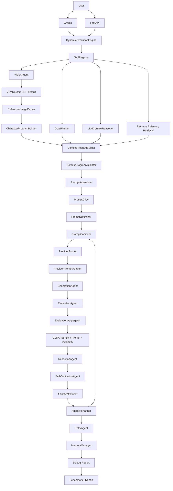

# Architecture

This document summarizes the current v1.0-oriented architecture of Multimodal AI Agent Playground.

## Layered View

```text
User
  |
  +--> Gradio UI
  |
  +--> FastAPI Service Layer
          |
          v
Planner / Execution Layer
  |
  +--> PlannerAgent
  +--> DynamicExecutionEngine
  +--> ToolRegistry
  +--> AgentState
          |
          v
Vision and Context Layer
  |
  +--> VisionAgent
  +--> VLMRouter: BLIP default, Florence/Qwen skeletons
  +--> ReferenceImageParser
  +--> CharacterProgramBuilder
  +--> GoalPlanner
  +--> LLMContextReasoner
  +--> RetrievalAgent
  +--> ContextProgramBuilder
  +--> ContextProgramValidator
          |
          v
Prompt Layer
  |
  +--> PromptAssembler
  +--> PromptCritic / LLMPromptCriticAgent
  +--> PromptOptimizer / LLMPromptOptimizerAgent
  +--> PromptCompiler
          |
          v
Provider Layer
  |
  +--> ProviderRouter
  +--> ProviderPromptAdapter
  +--> AIModelService
          |
          v
Generation and Evaluation Layer
  |
  +--> GenerationAgent
  +--> EvaluationAgent
  +--> EvaluationAggregator
  +--> CLIP / Identity / Prompt / Aesthetic Metrics
          |
          v
Reasoning Loop
  |
  +--> ReflectionAgent
  +--> SelfVerificationAgent
  +--> StrategySelector
  +--> AdaptivePlanner
  +--> RetryAgent
          |
          v
Observability and Memory
  |
  +--> MemoryManager
  +--> DebugReportManager
  +--> BenchmarkRunner
  +--> ReportGenerator
```

## Mermaid Diagram



## Runtime Flow

1. User provides an image and/or prompt through Gradio or FastAPI.
2. Planner and execution engine initialize state and execution order.
3. Vision layer extracts standard `vision_result`, parses Reference Image structure, and builds Character Program.
4. GoalPlanner creates Goal Tree and priority hierarchy.
5. ContextProgramBuilder creates structured provider-independent context.
6. ContextProgramValidator checks schema and provider compatibility.
7. Prompt layer assembles, critiques, optimizes, and compiles provider prompt package.
8. Provider layer selects and adapts generation provider input.
9. GenerationAgent creates an output image.
10. EvaluationAggregator computes weighted score across CLIP and rule metrics.
11. Reflection and Self Verification analyze the result.
12. StrategySelector chooses a candidate strategy.
13. AdaptivePlanner updates context and retry prompt if needed.
14. Memory, debug report, and benchmark artifacts preserve observability.

## Key Boundaries

- UI/API do not know internal agent details.
- ToolRegistry isolates execution engine from concrete agent classes.
- Context Program separates semantic context from provider prompt text.
- Reference Image Parser separates structured visual identity/context from plain captions.
- Standard VLM schema keeps BLIP, Florence-2, and Qwen-VL adapters interchangeable.
- PromptCompiler separates provider-independent context from provider-specific prompt packages.
- EvaluationAggregator separates metric computation from reflection/retry policy.
- SelfVerificationAgent checks whether replanning is necessary before strategy selection.
- DebugReportManager keeps AI workflow observability separate from generation logic.

## Future Work

- Docker and CI for v1.0 release
- Queue-based generation
- Multi-session memory
- Benchmark dashboard
- VLM Judge and real multi-metric expansion
