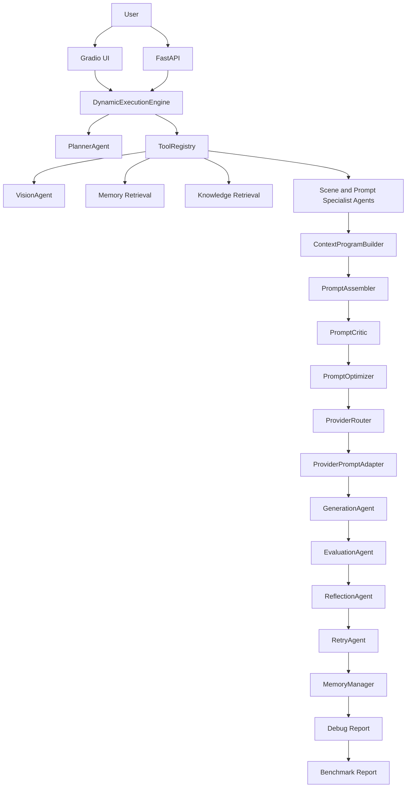

# Architecture

## Table of Contents

- [Architecture Layers](#architecture-layers)
- [Mermaid Diagram](#mermaid-diagram)
- [Runtime Flow](#runtime-flow)
- [Key Boundaries](#key-boundaries)
- [Future Work](#future-work)

## Architecture Layers

```text
UI Layer
-> Gradio
-> FastAPI

Execution Layer
-> PlannerAgent
-> DynamicExecutionEngine
-> AgentState
-> ToolRegistry

Agent Layer
-> VisionAgent
-> RetrievalAgent
-> ScenePlanningAgent
-> Character / Style / Layout / Pose / Expression / Lighting / Negative Agents
-> ContextProgramBuilder
-> PromptAssembler
-> PromptCritic
-> PromptOptimizer

Provider Layer
-> ProviderRouter
-> ProviderPromptAdapter
-> GenerationAgent

Evaluation Layer
-> EvaluationAgent
-> ReflectionAgent
-> RetryAgent

Persistence and Observability
-> MemoryManager
-> DebugReportManager
-> BenchmarkRunner
-> ReportGenerator
```

## Mermaid Diagram



## Runtime Flow

1. UI or API receives image and user prompt.
2. Planner creates an execution plan.
3. ExecutionEngine dispatches steps through ToolRegistry.
4. Vision, memory, and retrieval add context.
5. Specialist agents build visual sections.
6. ContextProgramBuilder creates a provider-independent context program.
7. PromptAssembler creates a canonical prompt.
8. PromptCritic and PromptOptimizer review and improve prompt quality.
9. ProviderRouter selects provider from config.
10. ProviderPromptAdapter compiles provider-specific prompt.
11. GenerationAgent creates image output.
12. EvaluationAgent scores generated output.
13. ReflectionAgent and RetryAgent decide retry.
14. MemoryManager saves history.
15. DebugReport and Benchmark tools record observability artifacts.

## Key Boundaries

- UI/API should not know individual agent internals.
- ExecutionEngine owns workflow order.
- ToolRegistry owns agent lookup and invocation.
- ContextProgramBuilder owns structured context.
- PromptAssembler owns canonical prompt construction.
- ProviderPromptAdapter owns provider-specific prompt compilation.
- Generation, evaluation, memory, benchmark, and debug report stay separated.

## Future Work

- Context Program v2 schema validation
- Queue-based execution
- Multi-session state
- Dashboard and benchmark dashboard
- Deployment architecture with Docker and Docker Compose
