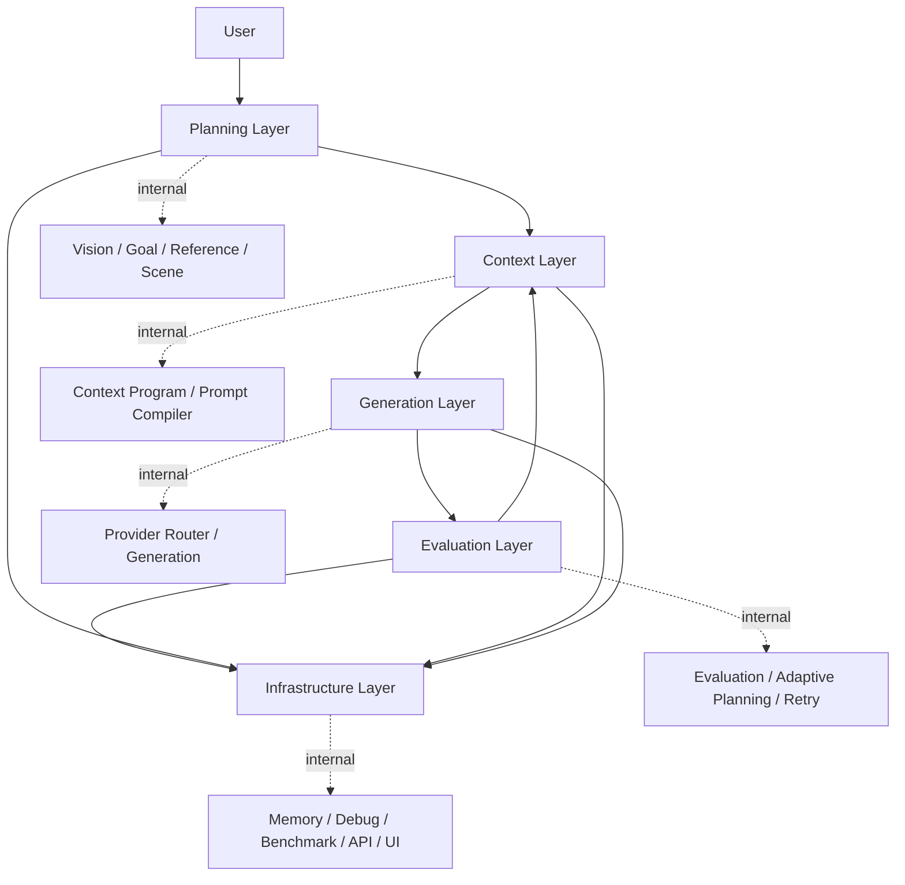

# Architecture

This document describes the responsibility-based architecture of Multimodal AI Agent Playground, including the v1.5 Florence Vision Parser upgrade.

## Target Architecture

```text
User
  |
  v
Planning Layer
  |
  v
Context Layer
  |
  v
Generation Layer
  |
  v
Evaluation Layer
  |
  v
Infrastructure Layer
```

## Layer Responsibilities

| Layer | Responsibility | Internal Examples |
| --- | --- | --- |
| Planning Layer | Understand user intent and reference image. | Vision Router, BLIP, Florence-2, Reference Parsing, Goal Planning, Character Extraction, Scene Planning |
| Context Layer | Build generation-ready context. | Character Program, Context Program, Prompt Rendering Engine, Prompt Validation, Prompt Optimization |
| Generation Layer | Generate with provider-specific adaptation. | Provider Router, Provider Adapter, Generation Agent, FLUX |
| Evaluation Layer | Evaluate result and adapt next plan. | Evaluation Aggregator, Reflection, Hypothesis, Strategy, Adaptive Planning, Retry |
| Infrastructure Layer | Support runtime, observability, and access. | Memory, History, Debug Report, Benchmark, FastAPI, Gradio |

## Mermaid Diagram



## Runtime Flow

1. Planning Layer reads user input and image reference.
2. Context Layer turns planning output into provider-ready context and prompt package.
3. Generation Layer chooses provider and generates the image.
4. Evaluation Layer scores the result and decides whether adaptation or retry is needed.
5. Infrastructure Layer records memory, debug reports, benchmark outputs, and exposes UI/API access.

## Vision Layer v1.5

The Vision Layer no longer treats BLIP as the framework boundary. `VisionAgent` calls `VLMRouter`, and the selected provider returns a shared `vision_result`.

```text
Image
  |
  v
VisionAgent
  |
  v
VLMRouter
  |
  +-- BLIPVLM (default)
  +-- FlorenceVLM (Florence-2 adapter, BLIP fallback)
  |
  v
Standard Vision Result
  |
  v
ReferenceImageParser
```

Florence-2 is routed through task prompts sequentially:

```text
FlorenceVLM
  |
  +-- <CAPTION>          -> caption
  +-- <DETAILED_CAPTION> -> detailed_caption
  +-- <OD>               -> objects[{name, bbox}]
  +-- OCR skeleton       -> ocr[]
```

### Standard Vision Result Schema

Every provider returns these core fields:

```json
{
  "caption": "",
  "detailed_caption": "",
  "objects": [],
  "regions": [],
  "characters": [],
  "scene": {},
  "style": {},
  "ocr": [],
  "colors": {},
  "composition": {},
  "provider": "",
  "model": "",
  "used_fallback": false,
  "latency": 0.0
}
```

Backward-compatible aliases such as `detailed_description`, `character_hints`, and `composition_hints` are still preserved for older downstream components.

### Reference Parsing Priority

`ReferenceImageParser` now reads structured fields first:

```text
objects
-> detailed_caption
-> caption
-> fallback parsing
```

This keeps caption parsing as a fallback while allowing Florence-2 object detection and detailed captions to supply richer visual understanding when available. Object records are normalized as `{name, bbox}` so accessories and props can be preserved as structured reference context.

## Reasoning Boundary

For this v1.1 VLM-only stabilization, LLM reasoning remains on the existing rule/mock fallback path. OpenAI API calls are not required for the default workflow.

## Prompt Rendering Engine v1.2

The Context Layer renders different prompts for different model-facing jobs:

```text
Context Program
  |
  v
Prompt Rendering Engine
  |
  +-- generation_prompt
  +-- clip_prompt
  +-- pickscore_prompt
  +-- vlm_judge_prompt
  +-- negative_prompt
```

`generation_prompt` preserves the existing provider generation behavior. `clip_prompt` is a short semantic summary that removes quality-only terms and negative prompt language. `pickscore_prompt` keeps preference-oriented quality, composition, and style cues. `vlm_judge_prompt` is a longer instruction for future visual judging against reference and generated images.

## Evaluation Prompt Routing v1.3

The Evaluation Layer consumes prompt variants by metric:

```text
generation_prompt -> Generation Provider
clip_prompt       -> CLIP Metric
generation_prompt + context_program -> Prompt Metric
pickscore_prompt  -> Aesthetic / future PickScore-style metric
vlm_judge_prompt  -> VLM Judge skeleton
reference image + generated image -> DINO Identity Metric
```

CLIP does not receive the full generation prompt. This keeps evaluation under the short CLIP text budget and prevents quality-only tags or negative prompt terms from distorting semantic alignment.

## DINO Identity Metric v1.4

DINO complements CLIP instead of replacing it:

```text
CLIP: prompt text <-> generated image semantic alignment
DINO: reference image <-> generated image visual consistency
```

When a reference image and generated image are available, the DINO metric attempts to use `facebook/dinov2-small` through the existing `torch` and `transformers` stack. If the model cannot be loaded or either image is missing, the metric returns an enabled=false fallback result and the Evaluation Layer uses the existing rule-based identity score.

## Evaluation Layer Stabilization v1.6

Every metric returns the same schema:

```json
{
  "name": "",
  "score": 0.0,
  "enabled": true,
  "reason": "",
  "used_fallback": false
}
```

The aggregator always exports:

```json
{
  "metrics": [],
  "semantic_alignment": 0.0,
  "identity_preservation": 0.0,
  "prompt_consistency": 0.0,
  "aesthetic_quality": 0.0,
  "overall_score": 0.0,
  "weighted_score": 0.0,
  "metric_summary": "",
  "used_fallback": false
}
```

Weighted score uses only enabled metrics. If all weighted metrics are disabled, `weighted_score` is `0.0` and `used_fallback` becomes `true`. This keeps Reflection, Retry, Debug Report, FastAPI, Gradio, and Benchmark consumers compatible with a stable score contract.

## Context Cache and Incremental Execution v1.7

The Execution Engine can skip selected layers when their input signature has not changed.

```text
Input
  |
  v
Planning Layer
  |
  v
Dirty Check
  |
  +-- cache hit  -> restore artifact and skip step
  +-- cache miss -> run step and update cache
  |
  v
Context / Generation / Evaluation
```

Cached artifacts:

- `goal_tree`
- `caption` and `vision_result`
- `reference_image`
- `character_program`
- `context_program`
- prompt compiler outputs such as `generation_prompt`, `clip_prompt`, and `compiled_prompt_package`
- `output_image_path` when the generation prompt is unchanged and the cached image file exists

Debug reports record:

- `executed_layers`
- `skipped_layers`
- `dirty_reasons`
- `context_cache_path`

This keeps repeated runs inspectable while avoiding unnecessary work for unchanged planning/context/generation inputs.

## Design Boundaries

- Agents are internal implementation details.
- Layers are the public explanation model.
- Context Engineering owns the conversion from intent to generation-ready structured data.
- Generation does not own evaluation or retry policy.
- Evaluation owns adaptive planning and retry decision.
- Infrastructure owns memory, debug report, benchmark, API, and UI support.

## Why Responsibility Refactoring?

The project contains many specialized components. Listing every agent makes the framework look more complex than it is. Responsibility-based layers make it easier to understand what the system does and where each capability belongs.

## What Did Not Change

- Core execution order is preserved.
- Existing agents and tools are preserved.
- Florence-2 is introduced behind the existing VLM adapter boundary.
- BLIP remains the default and fallback provider.
- LLM reasoning remains rule/mock fallback for this release focus.
- Generation, Evaluation, Adaptive Planning, Memory, FastAPI, Docker, and Benchmark layers are unchanged.

## Future Work

- Continue simplifying ExecutionEngine comments and trace output.
- Organize AgentState fields by layer ownership.
- Add CI smoke tests for compile, import, FastAPI, and Docker.
- Polish demo assets for v1.0 release.
