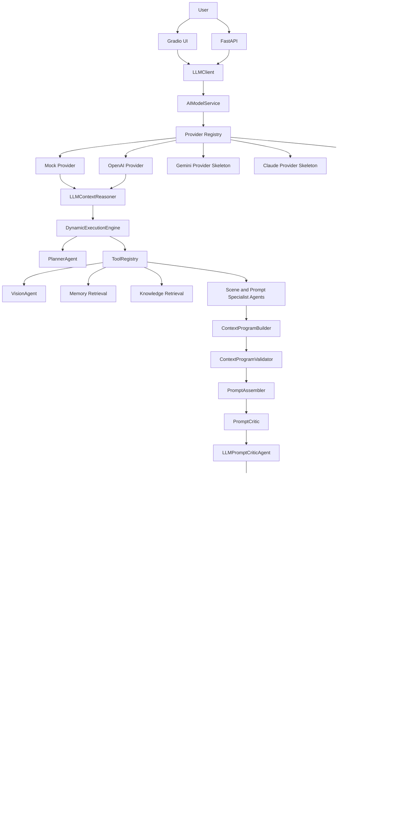

# Architecture

## Table of Contents

- [Architecture Layers](#architecture-layers)
- [Mermaid Diagram](#mermaid-diagram)
- [Runtime Flow](#runtime-flow)
- [Key Boundaries](#key-boundaries)
- [Future Work](#future-work)

## Architecture Layers

```text
UI Layer
-> Gradio
-> FastAPI

Semantic Planning Layer
-> LLMClient
-> AIModelService
-> MockLLM
-> LLMContextReasoner

Execution Layer
-> PlannerAgent
-> DynamicExecutionEngine
-> AgentState
-> ToolRegistry

Agent Layer
-> VisionAgent
-> RetrievalAgent
-> ScenePlanningAgent
-> Character / Style / Layout / Pose / Expression / Lighting / Negative Agents
-> ContextProgramBuilder
-> ContextProgramValidator
-> PromptAssembler
-> PromptCritic
-> LLMPromptCriticAgent
-> PromptOptimizer
-> LLMPromptOptimizerAgent

Provider Layer
-> ProviderRouter
-> PromptCompiler
-> ProviderPromptAdapter
-> GenerationAgent

Evaluation Layer
-> EvaluationAgent
-> ReflectionAgent
-> RetryAgent

Persistence and Observability
-> MemoryManager
-> DebugReportManager
-> BenchmarkRunner
-> ReportGenerator
```

## Mermaid Diagram



## Runtime Flow

1. UI or API receives image and user prompt.
2. LLMContextReasoner creates semantic planning fields without generating a prompt.
3. Planner creates an execution plan.
4. ExecutionEngine dispatches steps through ToolRegistry.
5. Vision, memory, and retrieval add context.
6. Specialist agents build visual sections.
7. ContextProgramBuilder creates a provider-independent context program.
8. ContextProgramValidator checks schema, section types, and provider compatibility.
9. PromptAssembler creates a canonical prompt.
10. PromptCritic performs rule-based prompt review.
11. LLMPromptCriticAgent performs optional semantic prompt critique.
12. PromptOptimizer reviews and improves prompt quality.
13. ProviderRouter selects provider from config.
14. PromptCompiler converts Context Program into a provider-specific prompt package.
15. ProviderPromptAdapter turns the compiled package into final provider input.
16. GenerationAgent creates image output.
17. EvaluationAgent scores generated output.
18. ReflectionAgent and RetryAgent decide retry.
19. MemoryManager saves history.
20. DebugReport and Benchmark tools record observability artifacts.

## Key Boundaries

- UI/API should not know individual agent internals.
- LLMClient owns provider abstraction for reason, critic, and optimize calls.
- AIModelService owns provider dispatch below LLMClient.
- OpenAIProvider owns optional real OpenAI calls and falls back to MockProvider when unavailable.
- LLMContextReasoner owns semantic intent interpretation before prompt construction.
- ExecutionEngine owns workflow order.
- ToolRegistry owns agent lookup and invocation.
- ContextProgramBuilder owns structured context.
- ContextProgramValidator owns context schema and provider compatibility checks.
- PromptAssembler owns canonical prompt construction.
- PromptCriticAgent owns deterministic checks; LLMPromptCriticAgent owns semantic mock/fallback critique.
- PromptCompiler owns context-program-to-provider-package compilation.
- ProviderPromptAdapter owns provider-specific prompt compilation.
- Generation, evaluation, memory, benchmark, and debug report stay separated.

## Future Work

- Context Program v2 schema validation
- Queue-based execution
- Multi-session state
- Dashboard and benchmark dashboard
- Deployment architecture with Docker and Docker Compose
