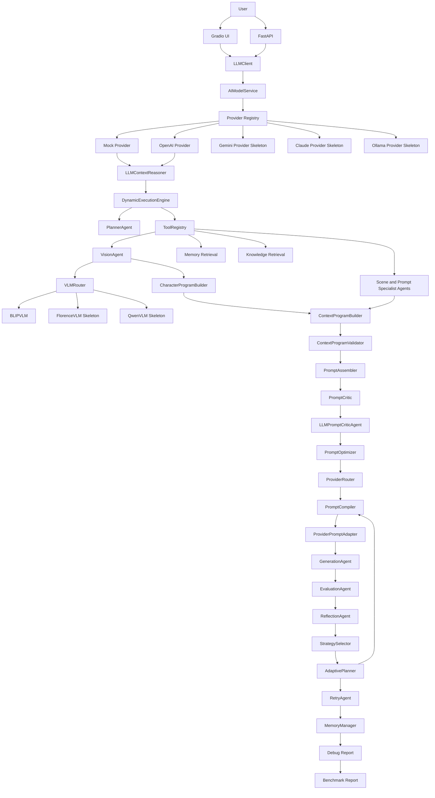

# Architecture

## Table of Contents

- [Architecture Layers](#architecture-layers)
- [Mermaid Diagram](#mermaid-diagram)
- [Runtime Flow](#runtime-flow)
- [Key Boundaries](#key-boundaries)
- [Future Work](#future-work)

## Architecture Layers

```text
UI Layer
-> Gradio
-> FastAPI

Semantic Planning Layer
-> LLMClient
-> AIModelService
-> MockLLM
-> GoalPlanner
-> LLMContextReasoner

Execution Layer
-> PlannerAgent
-> DynamicExecutionEngine
-> AgentState
-> ToolRegistry

Agent Layer
-> VisionAgent
-> VLMRouter
-> BLIPVLM / FlorenceVLM Skeleton / QwenVLM Skeleton
-> CharacterProgramBuilder
-> GoalPlanner
-> RetrievalAgent
-> ScenePlanningAgent
-> Character / Style / Layout / Pose / Expression / Lighting / Negative Agents
-> ContextProgramBuilder
-> ContextProgramValidator
-> PromptAssembler
-> PromptCritic
-> LLMPromptCriticAgent
-> PromptOptimizer
-> LLMPromptOptimizerAgent

Provider Layer
-> ProviderRouter
-> PromptCompiler
-> ProviderPromptAdapter
-> GenerationAgent

Evaluation Layer
-> EvaluationAgent
-> AdaptivePlanner
-> ReflectionAgent
-> RetryAgent

Persistence and Observability
-> MemoryManager
-> DebugReportManager
-> BenchmarkRunner
-> ReportGenerator
```

## Mermaid Diagram



## Runtime Flow

1. UI or API receives image and user prompt.
2. LLMContextReasoner creates semantic planning fields without generating a prompt.
3. Planner creates an execution plan.
4. ExecutionEngine dispatches steps through ToolRegistry.
5. VisionAgent routes image understanding through VLMRouter and stores caption-compatible vision output.
6. CharacterProgramBuilder converts vision output into structured identity and appearance data.
7. GoalPlanner creates a Goal Tree with priorities and success criteria.
8. Memory and retrieval add context.
9. Specialist agents build visual sections.
10. ContextProgramBuilder creates a provider-independent context program with Character Program and Goal Tree data.
11. ContextProgramValidator checks schema, section types, and provider compatibility.
12. PromptAssembler creates a canonical prompt.
13. PromptCritic performs rule-based prompt review.
14. LLMPromptCriticAgent performs optional semantic prompt critique.
15. PromptOptimizer reviews and improves prompt quality.
16. ProviderRouter selects provider from config.
17. PromptCompiler converts Context Program into a provider-specific prompt package.
18. ProviderPromptAdapter turns the compiled package into final provider input.
19. GenerationAgent creates image output.
20. EvaluationAgent scores generated output.
21. ReflectionAgent analyzes failure signals.
22. StrategySelector generates candidate strategies and selects the highest-scoring option.
23. AdaptivePlanner creates a re-planning strategy and updates context before retry.
24. RetryAgent decides whether to run the second attempt.
25. MemoryManager saves history.
26. DebugReport and Benchmark tools record observability artifacts.

## Key Boundaries

- UI/API should not know individual agent internals.
- LLMClient owns provider abstraction for reason, critic, and optimize calls.
- AIModelService owns provider dispatch below LLMClient.
- OpenAIProvider owns optional real OpenAI calls and falls back to MockProvider when unavailable.
- LLMContextReasoner owns semantic intent interpretation before prompt construction.
- VLMRouter owns vision provider selection and keeps VisionAgent independent from a specific VLM.
- CharacterProgramBuilder owns structured character identity representation from vision output.
- GoalPlanner owns priority planning and success criteria before execution planning.
- ExecutionEngine owns workflow order.
- ToolRegistry owns agent lookup and invocation.
- ContextProgramBuilder owns structured context.
- ContextProgramValidator owns context schema and provider compatibility checks.
- PromptAssembler owns canonical prompt construction.
- PromptCriticAgent owns deterministic checks; LLMPromptCriticAgent owns semantic mock/fallback critique.
- PromptCompiler owns context-program-to-provider-package compilation.
- ProviderPromptAdapter owns provider-specific prompt compilation.
- StrategySelector owns candidate strategy generation and explainable selection before adaptive planning.
- AdaptivePlanner owns rule-based failure analysis and re-planning between reflection and retry.
- Generation, evaluation, memory, benchmark, and debug report stay separated.

## Future Work

- Context Program v2 schema validation
- Queue-based execution
- Multi-session state
- Dashboard and benchmark dashboard
- Deployment architecture with Docker and Docker Compose
