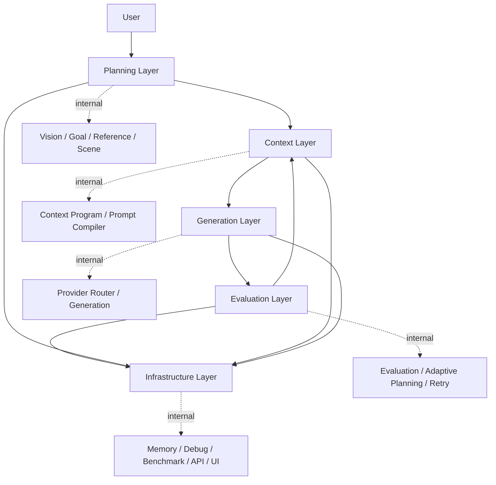

# Architecture

This document describes the v1.0 RC2 responsibility-based architecture of Multimodal AI Agent Playground.

## Target Architecture

```text
User
  |
  v
Planning Layer
  |
  v
Context Layer
  |
  v
Generation Layer
  |
  v
Evaluation Layer
  |
  v
Infrastructure Layer
```

## Layer Responsibilities

| Layer | Responsibility | Internal Examples |
| --- | --- | --- |
| Planning Layer | Understand user intent and reference image. | Vision, Goal Planning, Reference Parsing, Character Extraction, Scene Planning |
| Context Layer | Build generation-ready context. | Character Program, Context Program, Prompt Compilation, Prompt Validation, Prompt Optimization |
| Generation Layer | Generate with provider-specific adaptation. | Provider Router, Provider Adapter, Generation Agent, FLUX |
| Evaluation Layer | Evaluate result and adapt next plan. | Evaluation Aggregator, Reflection, Hypothesis, Strategy, Adaptive Planning, Retry |
| Infrastructure Layer | Support runtime, observability, and access. | Memory, History, Debug Report, Benchmark, FastAPI, Gradio |

## Mermaid Diagram



## Runtime Flow

1. Planning Layer reads user input and image reference.
2. Context Layer turns planning output into provider-ready context and prompt package.
3. Generation Layer chooses provider and generates the image.
4. Evaluation Layer scores the result and decides whether adaptation or retry is needed.
5. Infrastructure Layer records memory, debug reports, benchmark outputs, and exposes UI/API access.

## Design Boundaries

- Agents are internal implementation details.
- Layers are the public explanation model.
- Context Engineering owns the conversion from intent to generation-ready structured data.
- Generation does not own evaluation or retry policy.
- Evaluation owns adaptive planning and retry decision.
- Infrastructure owns memory, debug report, benchmark, API, and UI support.

## Why Responsibility Refactoring?

The project contains many specialized components. Listing every agent makes the framework look more complex than it is. Responsibility-based layers make it easier to understand what the system does and where each capability belongs.

## What Did Not Change

- Core execution order is preserved.
- Existing agents and tools are preserved.
- No new AI model, VLM, LLM, tool, or metric was added.
- The cleanup is architectural communication and light metadata/log organization.

## Future Work

- Continue simplifying ExecutionEngine comments and trace output.
- Organize AgentState fields by layer ownership.
- Add CI smoke tests for compile, import, FastAPI, and Docker.
- Polish demo assets for v1.0 release.
