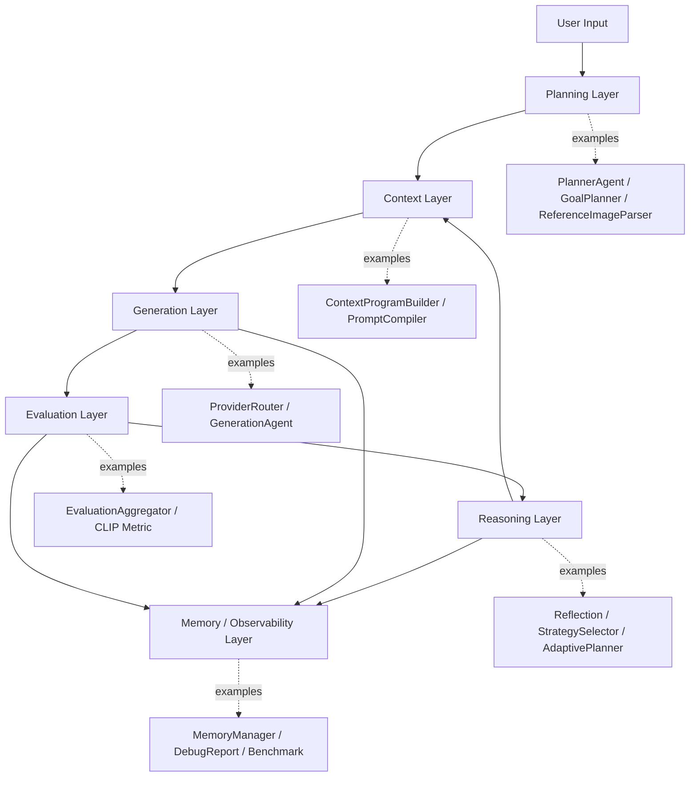

# Architecture

This document describes the v1.0 RC1 architecture of Multimodal AI Agent Playground using a layer-based view.

## Layer Diagram

```text
User Input
  |
  v
Planning Layer
  |
  v
Context Layer
  |
  v
Generation Layer
  |
  v
Evaluation Layer
  |
  v
Reasoning Layer
  |
  v
Memory / Observability Layer
```

## Layer Responsibilities

| Layer | Responsibility | Representative Components |
| --- | --- | --- |
| Planning Layer | Interpret request, reference image, goal, scene, and character identity. | PlannerAgent, GoalPlanner, ReferenceImageParser, CharacterProgramBuilder |
| Context Layer | Convert planning outputs into structured Context Program and prompt program. | ContextProgramBuilder, ContextProgramValidator, PromptAssembler, PromptCompiler |
| Generation Layer | Select provider, adapt prompt, and generate image. | ProviderRouter, ProviderPromptAdapter, GenerationAgent |
| Evaluation Layer | Evaluate generated image through multiple metrics. | EvaluationAgent, EvaluationAggregator, CLIP/Identity/Prompt/Aesthetic metrics |
| Reasoning Layer | Analyze failures, verify goals, select strategy, and adapt plan. | ReflectionAgent, SelfVerificationAgent, StrategySelector, AdaptivePlanner |
| Memory / Observability Layer | Store run history, debug reports, benchmark outputs, and prompt previews. | MemoryManager, DebugReportManager, BenchmarkRunner, ReportGenerator |

## Mermaid Diagram



## Runtime Flow

1. User provides an image and/or text prompt through Gradio or FastAPI.
2. Planning Layer builds goals, reference image structure, scene intent, and character program.
3. Context Layer creates and validates Context Program, then compiles provider-specific prompt packages.
4. Generation Layer selects a provider and generates an image.
5. Evaluation Layer scores the output with CLIP and rule-based metrics.
6. Reasoning Layer reflects, verifies, selects a strategy, and may adapt the next prompt.
7. Memory / Observability Layer saves history, debug reports, and benchmark artifacts.

## Key Design Boundaries

- UI/API should not know individual agent internals.
- Planning produces structured intent and visual understanding, not final model prompts.
- Context Program is provider-independent.
- PromptCompiler converts Context Program into provider-specific prompt packages.
- Generation provider details are isolated behind routing and adapter layers.
- Evaluation is metric-based and explainable.
- Reasoning is optional-LLM capable but rule fallback remains the default stability path.
- Observability is treated as a first-class layer through debug reports and benchmark outputs.

## Why Layer-based Organization?

The project contains many agents, but the important architecture is not the number of classes. The important idea is that each class belongs to a layer with a clear responsibility. This makes the framework easier to explain, maintain, test, and extend.

## Future Work

- ExecutionEngine cleanup using the same layer naming.
- AgentState organization by layer-owned fields.
- CI checks for compile, import, and Docker smoke tests.
- Demo polish and curated release assets.
