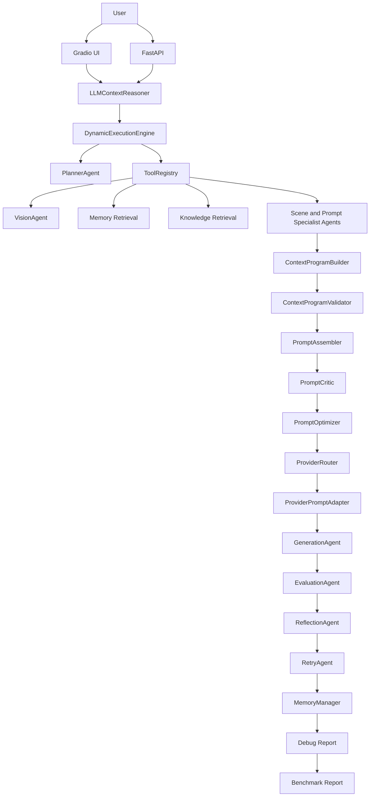

# Architecture

## Table of Contents

- [Architecture Layers](#architecture-layers)
- [Mermaid Diagram](#mermaid-diagram)
- [Runtime Flow](#runtime-flow)
- [Key Boundaries](#key-boundaries)
- [Future Work](#future-work)

## Architecture Layers

```text
UI Layer
-> Gradio
-> FastAPI

Semantic Planning Layer
-> LLMContextReasoner

Execution Layer
-> PlannerAgent
-> DynamicExecutionEngine
-> AgentState
-> ToolRegistry

Agent Layer
-> VisionAgent
-> RetrievalAgent
-> ScenePlanningAgent
-> Character / Style / Layout / Pose / Expression / Lighting / Negative Agents
-> ContextProgramBuilder
-> ContextProgramValidator
-> PromptAssembler
-> PromptCritic
-> PromptOptimizer

Provider Layer
-> ProviderRouter
-> ProviderPromptAdapter
-> GenerationAgent

Evaluation Layer
-> EvaluationAgent
-> ReflectionAgent
-> RetryAgent

Persistence and Observability
-> MemoryManager
-> DebugReportManager
-> BenchmarkRunner
-> ReportGenerator
```

## Mermaid Diagram



## Runtime Flow

1. UI or API receives image and user prompt.
2. LLMContextReasoner creates semantic planning fields without generating a prompt.
3. Planner creates an execution plan.
4. ExecutionEngine dispatches steps through ToolRegistry.
5. Vision, memory, and retrieval add context.
6. Specialist agents build visual sections.
7. ContextProgramBuilder creates a provider-independent context program.
8. ContextProgramValidator checks schema, section types, and provider compatibility.
9. PromptAssembler creates a canonical prompt.
10. PromptCritic and PromptOptimizer review and improve prompt quality.
11. ProviderRouter selects provider from config.
12. ProviderPromptAdapter compiles provider-specific prompt.
13. GenerationAgent creates image output.
14. EvaluationAgent scores generated output.
15. ReflectionAgent and RetryAgent decide retry.
16. MemoryManager saves history.
17. DebugReport and Benchmark tools record observability artifacts.

## Key Boundaries

- UI/API should not know individual agent internals.
- LLMContextReasoner owns semantic intent interpretation before prompt construction.
- ExecutionEngine owns workflow order.
- ToolRegistry owns agent lookup and invocation.
- ContextProgramBuilder owns structured context.
- ContextProgramValidator owns context schema and provider compatibility checks.
- PromptAssembler owns canonical prompt construction.
- ProviderPromptAdapter owns provider-specific prompt compilation.
- Generation, evaluation, memory, benchmark, and debug report stay separated.

## Future Work

- Context Program v2 schema validation
- Queue-based execution
- Multi-session state
- Dashboard and benchmark dashboard
- Deployment architecture with Docker and Docker Compose
